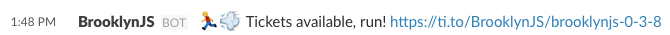

[author]: http://rinaldi.io
[brooklynjs]: http://brooklynjs.com
[slack-token]: https://api.slack.com/web#authentication

# brooklynjs

> Simple bot that warns you when tickets for [BrooklynJS][brooklynjs] are available.



## Why

I never got the chance to go to a BrooklynJS because the tickets are almost always sold out in a matter of minutes.

Since I'm on Slack all day anyway I created a simple Node.js script that will ping the events page every now and then to check for tickets and let me know on Slack if there's any. Maybe this will help me to finally attend!

## Running

```js
$ # Will ping the event page every 10 minutes
$ npm start
```

### Notes

* Make sure you fill the information under `options.js` properly ([generate a Slack token here][slack-token])
* Under `options.channel` you can either use a `#slack-channel` or a `@username`

## Test

```sh
$ npm test
```

## License

MIT ® [Rafael Rinaldi][author]
